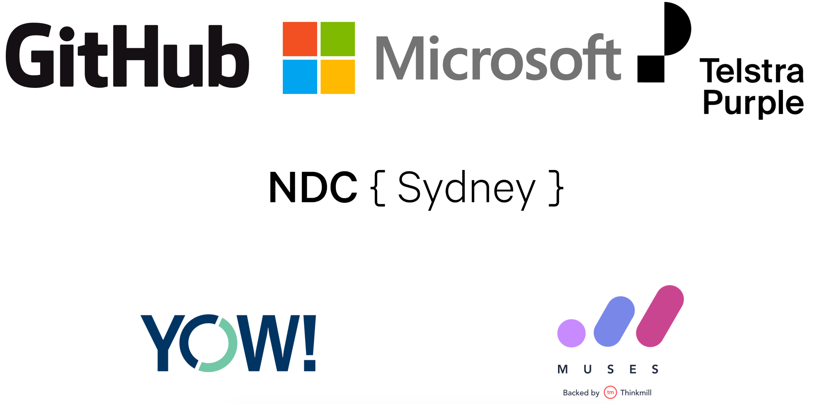

import { Card } from '@fusuma/client';

<!-- note
- So as I was coming here to DDDSydney today, I remember the time about 7-8 years ago when I was on a project where we had to recreate a few indexes in our database tables, I tested the change in our test and UAT environment and thought yay everything is working fine, all the application works as expected. And because I didn't know better at the time, I went ahead and requested to do the change on a friday afternoon. 

- Little did I know there were still plenty of activity in production during that time so when we were recreating the indexes, it took a very very long time, it got to a stage where the database ran out of temp storage and eventually hanged. Long story short, after an hour or so working with a DBA, we manage to fix the issue and that was my first experience with performance as a developer, albeit a very nasty one. It took away our weekday release privileges for the entire engineering team for about a year.

- YEAH A HUGE fail on my part but I have learnt a lot since then. Story aside my talk is on lessons learnt performance testing a crypto exchange API
-->
## 🚀
# Are we there yet?
#### Lessons Learnt Performance Testing A Crypto Exchange API
##### Ben Shi

  
<small>#dddsydney</small>

<small>
    <a href="https://twitter.com/hbish" target="_blank">
        <i class="fab fa-twitter"/> @hbish
    </a>
     | 
    <a href="https://www.linkedin.com/in/benshi/" target="_blank">
        <i class="fab fa-linkedin"/> /in/benshi
    </a>
     | 
    <a href="https://hbish.com" target="_blank">
        <i class="fas fa-home"/> hbish.com
    </a>
</small>

---
<!-- classes: fullscreen -->
<!-- note
- So with the industry evolving to have more and more focus on speed of delivery, there has been a heavy emphasis on unit-testing and integration testing to ensure our software is bug free and we have CI/CD in place to ensure we can move fast without breaking things. 

- However the act of running performance tests has always been a last minute exercise just before the software goes out the door. And when you do something last minute, you tend to do a really bad job at it. 

- I know my title is a bit clickbaity so before I go any further on how we can try and fix this. I just want to make it clear that this is a talk about performance testing and not about how to get rich on crypto trading. 
-->

## 👋 hi

---
<!-- classes: fullscreen -->
<!-- note
- Also I just want to thank all the AWESOME sponsors, organisers and volunteers.

- Without them DDDSydney 2019 just wouldn't be possible. So thank you.
-->

