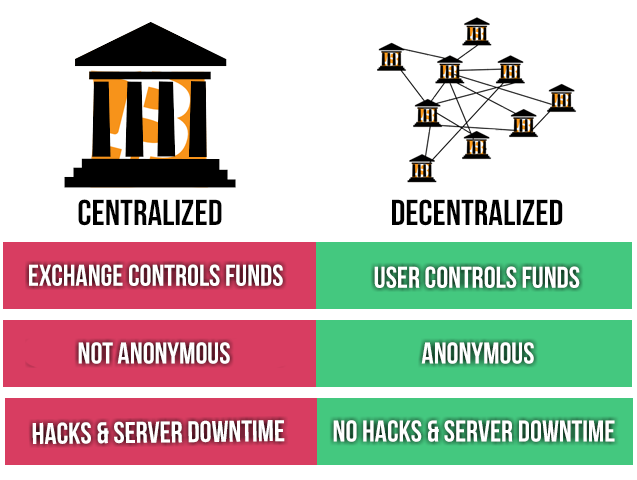
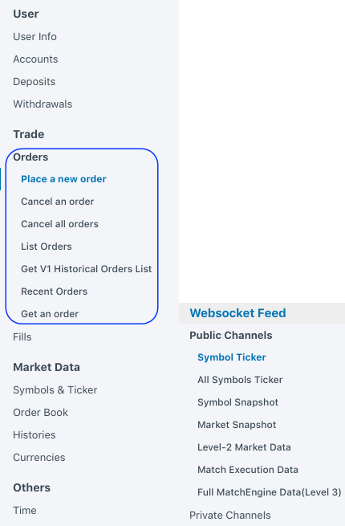

import { Card } from '@fusuma/client';

## Agenda

<!-- contents -->

---
<!-- sectionTitle: Quick Overview of Performance Testing -->
<!-- note: It can also serve to investigate, measure, validate or verify other quality attributes of the system, such as scalability, reliability and resource usage. 
-->

## ...a testing practice performed to determine how a system performs in terms of responsiveness and stability... 

(source: wikipedia)

--- 
## So like?

<div class="grid">
  <div class="column">
    
    <p>fast</p>
  </div>
  <div class="column">
    
    <p>faster</p>
  </div>
  <div class="column">
    
    <p>fastest</p>
  </div>
</div>

--- 
## What flavours does it come in?

- Load testing
- Stress testing
- Soak testing
- Spike testing
- Breakpoint testing
- Configuration testing
- Isolation testing
- Internet testing

---
<!-- classes: fullscreen-bg performance-testing -->
<!-- note
- Majority (90%) of the time people measure response time and throughput
-->
## What can we measure?

---
## What can we measure?
<div class="wrap grid">
    <div class="column">
        <h4>Client</h4>
        <ul>
            <li>Response Time - Round Trip</li>
            <li>Throughput</li>
        </ul>
    </div>
    <div class="column">
        <h4>Server</h4>
        <ul>
            <li>Response Time - Processing Time</li>
            <li>Throughput</li>
            <li>Server metrics - CPU, memory, disk I/O...</li>
            <li>Connection pooling</li>
            <li>Cache hit/miss ratios</li>
        </ul>
    </div>
</div>

---
<!-- note
- An trading exchange as the name implies is a marketplace where people exchange one thing for another
- It can be fiat money, physical commodity and in our case crypto-currencies
- Core function of an exchange is to ensure fair and orderly trading and efficient dissemination of price information
--->
## Crypto Exchange: A Crash Course

---
<!-- sectionTitle: Crash course on exchanges -->
<!-- note
- An trading exchange as the name implies is a marketplace where people exchange one thing for another
- It can be fiat money, physical commodity and in our case crypto-currencies
- Core function of an exchange is to ensure fair and orderly trading and efficient dissemination of price information
- Most exchanges are centralized meaning the exchange creates wallets on your behave and safeguards your money
- But there is a huge trend moving towards decentralised exchanges after a few hacking incidents such as Mt. Gox, Bitfinex and Binance.
-->
 
<small>source: <a href="https://en.bitcoinwiki.org/wiki/DEXes">bitcoinwiki</a></small>

--- 
<!-- note
- Some typical endpoints you may see on a crypto exchange
- Endpoints to retrieve you user and account information like your crypto holding and wallet details to allow you to deposit and withdraw you cryptocurrency 
- Trade/Order endpoints allows you to submit orders on to the exchange. To be executed when another order gets matched on the opposite side. These endpoints are the ones where we will be spent a lot of the talk on.
- Market data - symbols/tickers to see prices and the order book where all of the orders on the exchange are aggregated by the price. Basically see the supply/demand of a ticker.
- Websocket feed - to retrieve ticker information like the price of the symbol, the high/low over different period of time. I'm not going to spend to much time on these, if you are interested feel free to read up the API documentation.
-->
<Card
  left={}
  right={
    <>
      <h2>API</h2>
    </>
  }
/>

--- 
## Typical Architecture

```text
+-------------+---------------+
| RPC/Web API | Websocket API |
+----------------------------------------+
| Matching Engine | Asset Management     |
+----------------------------------------+-------------------+       +--------------------+
| Settlement Engine | Account Management | Wallet Management | <---> | Blockchain Network |
+----------------------------------------+---+---------------+       +--------------------+
| KYC Service | MFA/Security Services        |                                |
+--------------------------------------------+                                |
| Networking | Database | Event Bus & MQ     | <------------------------------+
+--------------------------------------------+
| Cold Wallet Storage                        |
+--------------------------------------------+
```

<p />
<small>additional reading 

[How do cryptocurrency exchanges work and what technologies are driving disruption? - Naveen Saraswat](https://hackernoon.com/how-do-cryptocurrency-exchanges-work-and-what-technologies-are-driving-disruption-33d0007eb018)  
</small>
