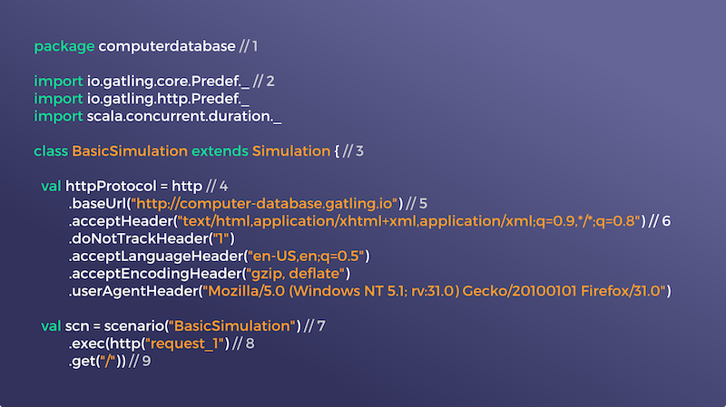
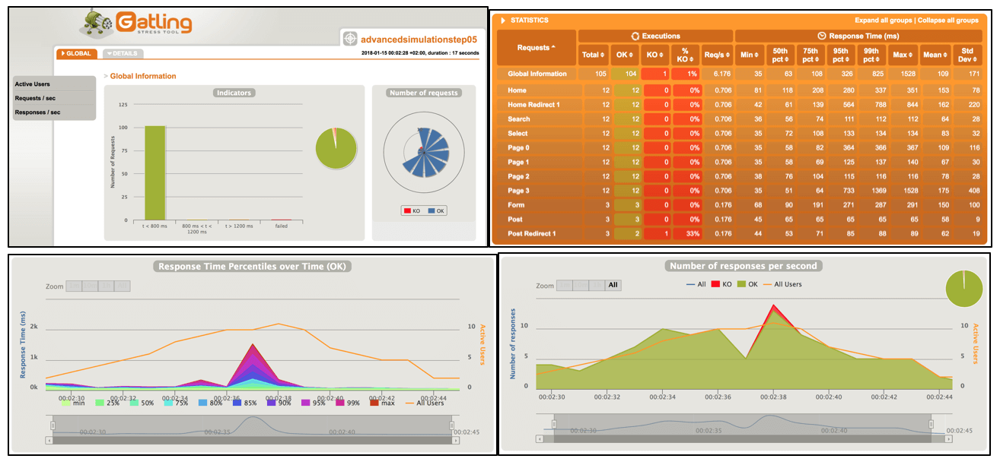

<!--note
- Now we are armed with the knowledge, lets take a look at what we will be focusing on for the rest of the talk

- I was contact by a crypto exchange to help them performance test their API. Particularly focusing on their order submission and execution flow to ensure as many orders get captured as possible across multiple regions at the same time.

- They were pretty easy on the load testing tool I get to use, and having to have performed some performance testing in the past I decided to go with Gatling.

-->
## Let the show begin!

- Centralised crypto exchange API
- Order submission/execution
- Gatling

 

---
<!-- note
- Gatling offers a couple benefits over other load testing tools. First of all its asynchronous and built on top of akka and netty which means you can deliver huge amount of load on a single instance.

- Its also not just a load runner, it has its own SDL built on scala, so you can customize your test suite however you like, you can have custom scenarios based on different use cases. It also has built in assertion so you can perform validation on your responses.

- Gatling has great reporting features as you can see below and excellent calculations and statistics for you to drill into the nitty gritty of your performance results.

- While it doesn't apply to API testing, gatling does comes with a recorder so if you are unfamiliar with scala you can literally use it and click through interactions to perform UI tests. 

- Most importantly its open source and widely used within the industry, youre able to scale your performance tests and run it across multiple instances to drive even more load
-->
## Gatling

- non-blocking/asynchronous stack (scala, akka, netty)
- not just a load runner, can be scripted using DSL
- built-in assertion
- good calculation and statistics
- nice reporting 
- comes with a recorder
- open-source*
- can run in a distributed fashion and fed into other performance platforms

    

        
    

    

        
    

