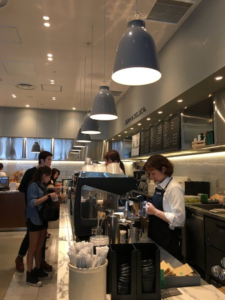

import { Card } from '@fusuma/client';

### 🛂
## Trust, but Verify (Developers)

--- 

## Developer's performance intuitions are often wrong

Myself included

---

## Things Devs might say

- "Get a bigger instance with more ram/cpu"
- "Just add more instances" 
- "It must be the database"
- "It's slow but it hasn't crashed yet"
- "Must be an environment issue"
- "Somethings wrong with your test suite"

--- 


---

## 🧐

```text
1% tile: 974.0 (ns)
5% tile: 1075.0 (ns)
10% tile: 2292.0 (ns)
25% tile: 2695.0 (ns)
50% tile: 3671.0 (ns)
75% tile: 10440.0 (ns)
90% tile: 10091923.799999999 (ns)
99% tile: 68835579.60000025 (ns)
```

---

## Things Devs might do

```rust
let start = Instant::now();
submit_order();
let duration = start.elapsed();

println!("Time elapsed in submit_order() is: {:?}", duration);
```

---
<!--note
- The coordinated omission problem makes something that is response time only measure service time, hiding the fact that things stalled.
-->
<Card
  right={}
  left={
  <>
    <h2>Coordinated Omission Problem</h2>
    <p />
    <small>additional reading: <a href="https://www.youtube.com/watch?v=lJ8ydIuPFeU">"How NOT to Measure Latency" by Gil Tene</a></small>
  </>
  }
/>

---


## Application Performance Monitoring Metrics
#### +
## Log Aggregation w/ Correlation IDs
#### =
## Observability 


---

## Without data you're just another person with an opinion. 

### - Edwards Deming

--- 

### ⏱ Collect Data

### 🍾 Find the bottleneck

### 🛠 Fix it

### ♻ Repeat 
