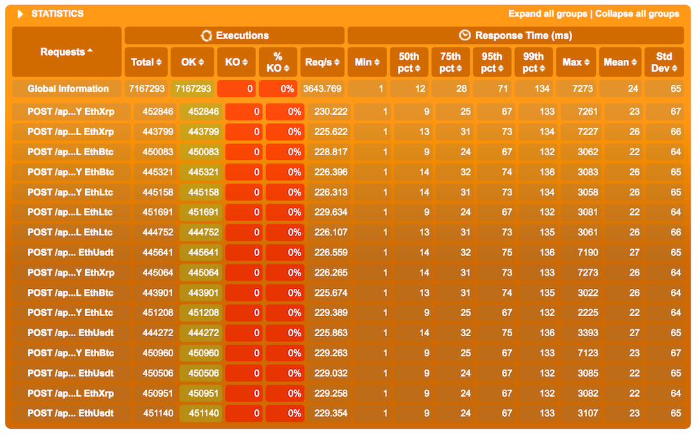
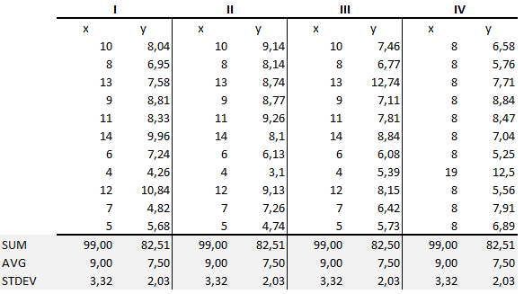
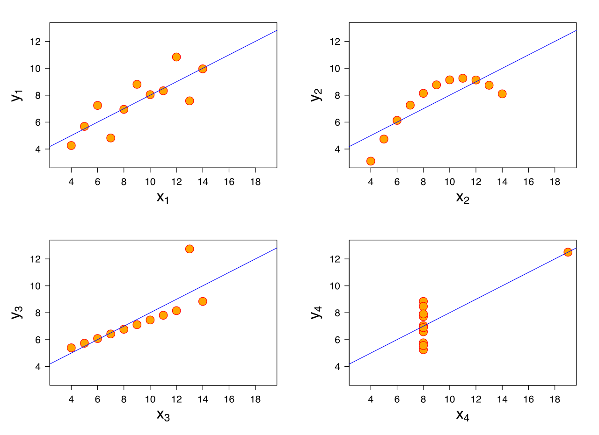
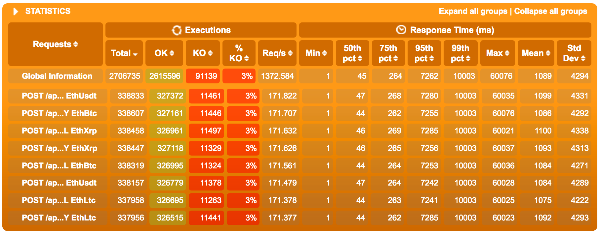
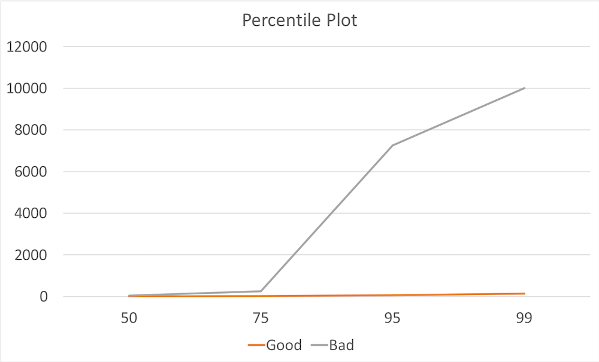

import { Card } from '@fusuma/client';

<!-- sectionTitle: 6. Stats Lie -->
<!-- note
- We talk about data but we have not really talked about statistics. So how can we interpret our data in a way that accurately represents the performance? 
-->
### 📉 📈
## Statistics Lie

---
<!-- note
- Lets take a look at one of our results again. What stats can we look at? Are there any red flags?

- You could probably look at mean or average, median or the standard deviation.
-->

---
<!-- note
- But I personally just ignore them all together.

- Why? because they only tell me the good stuff and not the bad stuff. Your mean and median would only shift if a significant amount of requests performed badly. In other words the sample size matters a lot and if you have millions and millions of requests in your test, you will only see issues if a majority of them behaved badly. 
-->
### Ignore

❌ Mean

❌ Median

❌ Standard Deviation

---
<!--note
- There is a really famous data set developed by Francis Anscombe, when plotted the 4 data set have a complete different distribution but have the exact same mean and standard deviation. 

Dataset I appears to have clean and well-fitting linear models.
Dataset II is not distributed normally.
In Dataset III the distribution is linear, but the calculated regression is thrown off by an outlier.
Dataset IV shows that one outlier is enough to produce a high correlation coefficient.
-->
## Anscombe's Quartlet 

<Card
  right={}
  left={}
/>

---
<!-- note
- So what should you look at then? Personally I think the percentiles and max value are very important.

- The max tells me if the system struggles to keep up with the request and even if its just a handful of requests. Those are the request I care about when I am performance tuning the system. I don't want to see stats that makes me feel good but I want stats that shows me whats bad.

- In terms of percentiles some developers or testers think that the 90th percentile is the holy grail of performance testing, while that is some what correct it still doesn't tell me anything about the other 10% 

- why should you ignore the 10% of bad stuff and report on the good stuff? arent you just lying to yourself to feel better? A better approach here is to look at all of the percentiles. Lets take a look at what I mean.
-->
### Look at

✅ Max

✅ Percentiles 

---
<!-- note
- so here I have a relatively good result of the crypto exchange API. 

- The average is only 24 ms, 

- But I immediately notice the max response time is taking up to 7 seconds. Indicating to me there is a bottleneck or some sort of latency spike. 
-->

---
<!-- note
- now lets take a look at a bad result

- its quite obvious this run performed much worse than the previous

- I actually terminated the test before it has finished, because all the stats are through the roof
-->

---
<!-- note
- if we plotted the all the percentiles available from both of the runs on a graph, you can notice the good run is relatively linear.
 
- Whereas the bad run starts off linear, but then a huge spike occurs just after the 75th percentile. This usually means 2 things either you have something seriously wrong with your API or you have some sort of coordinated omission problem with the load runner. In my case it was the former.

- The percentile plot is a good way to see if the system performance is scaling linearly and you can use it to identify roughly when the system starts to struggle to cope with the load.
-->

