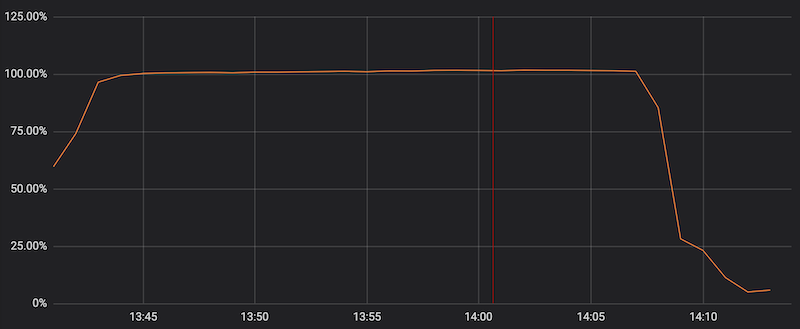

<!-- sectionTitle: Performance Engineering -->
<!--note
- Now with the time remaining, I'd thought I go through some quickfire performance engineering questions that I came across in the past

- And these doesn't apply to the crypto exchange API I was testing.

- Alright off we go
-->

### ⏱
## Performance Engineering
Quickfire Edition

---
<!-- note
- Every thing we talked about still apply to microservers and serverless, but there are 2 important things to look out for

- timeouts, so if you are seeing timeouts in your tests, make sure you work go through each microservices youre hitting and make sure the timeouts reduces as you get further and further away from the caller.

- the other thing is spike tests is extremely important, because chances are you are scaling horizontally in a microservices architecture. So how quickly you scale matters. If your services take 10 minutes to spin up by then the traffic on your API might have already died down. 

- This is especially true for a trading exchange where a trump tweet could stimulate the market 
-->
## What about Microservices/Serverless?
- Watch for timeouts
- Perform spike tests to determine time taken to scale

--- 
<!--note
- Now what about graphQL? again everything applies but it gets a lot more complicated depending on how the resolvers are implemented and you may need to performance test different combination of the request.

- This is where request tracing becomes crucial.
-->
## What about GraphQL?
- It's possible, but more complicated
- Different combination of fields and fragments
- Make sure you have sensible request tracing

--- 
<!--note
- I personally prefer using load testing frameworks that can be uses for other purposes and its a huge reason on why I selected gatling

- I can parameterize a few things and all of a sudden, I'm able to use the same test suite for E2E testing, to performance testing and to smoke testing.

- Obviously and I reiterate, your tests suite must be well thought out.
-->
## Many birds, one stone 

### Reusable Tests. Framework selection is critical!

<br />

E2E test in Dev/Test Deployment
```bash
./gradlew gatlingRun -DbaseUrl="http://dev.env:80/api" -DnumberOfUser=1 -DrunDurationSecs=300
```

Perf Test
```bash
./gradlew gatlingRun -DbaseUrl="http://perf.env:80/api" -DnumberOfUser=2000 -DrunDurationSecs=3600
```

Smoke Test in Production
```bash
./gradlew gatlingRun -DbaseUrl="http://prod.env:80/api" -DnumberOfUser=1 -DrunDurationSecs=10
```


---
<!-- note
- So extending on what we just talked about, we can reuse the tests in CI/CD as a initial checkpoint for performance since its just a gradle command

- You can decide to run a subset or the entire suite that is up to you. But make sure you collect the results per run and have some sort of way to flag if the performance degrades.

- The idea is to shift left and bump performance testing up the software development lifecycle to detect performance anomalies earlier

- And interestingly a couple weeks before I submitted my talk to dddsydney, CloudFlare, one of the worlds largest content delivery network and web infrastructure provider suffered a global outage due to a small change to their WAF rule
-->
## CI/CD

- Build a small subset of your performance testing suite as part of your pipeline 
- Monitor the build time and capture performance metrics
- Fail or Add alert for any executions that over n %
- Run perf early in the SDLC and as often as possible

---
<!-- note
- It doesn't take a lot to cause an outage

- What happened at Cloudflare, in a nutshell was a small change to a regular expression in it's WAF rules, backtracked and used up 100% of the CPU. This brought down Cloudflare’s core proxying, CDN and WAF functionality.

- What they immediately did after the outage was to introduce performance profiling to all of its WAF rules as part of their CI/CD, as well as a review of their SOPs for WAF rule deployments.

- If youre interested in root cause analysis and incident reports like I am. I strongly recommend you to have a look at cloudflare's blog post on its July 2nd outage. 

-->

### It doesn't take a lot to cause an outage

```text
A regular expression that backtracked enormously and exhausted CPU used for HTTP/HTTPS serving.
```




```text
Introduce performance profiling for all rules to the test suite. (ETA:  July 19)
```

<br />

<small>

Cloudflare Outage July 2019 - https://blog.cloudflare.com/details-of-the-cloudflare-outage-on-july-2-2019/

</small>

---
<!-- note
- last but not least and its a question that a lot of people ask, should we performance test in production?
-->
## Test in Production?

---

<!-- note
- My personal view is, YES but only if you have the capability to cleanup the data, 

- because production is production, youre not going to have another environment that is like for like with production in terms of deployed software version, especially in a microservices architecture, the data and also monitoring that exists

- In lieu of a cleanup process then the next best thing is to have a environment that is production like, but the caveat there is, its still not production but it will give you a good enough indicator.
-->
## Test in Production?
### Yes, only if you can cleanup the data

Otherwise, test in a separate environment with configuration similar to prod
